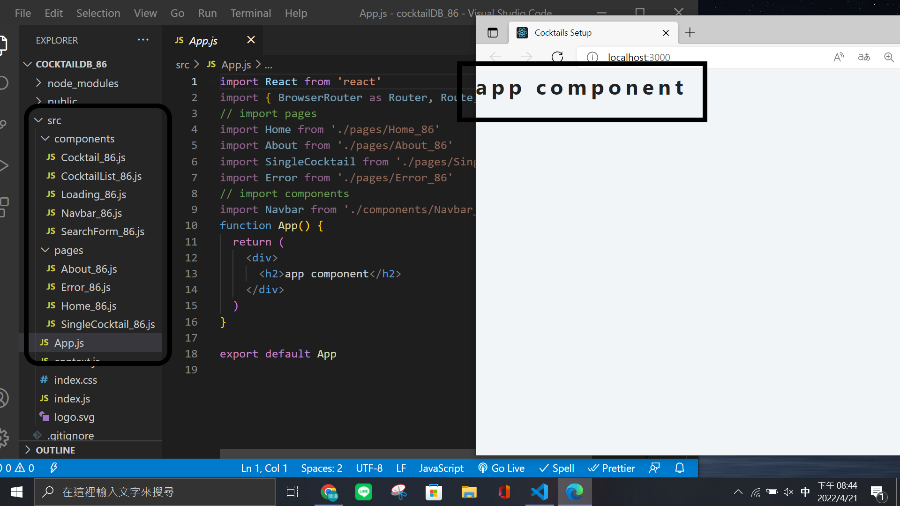
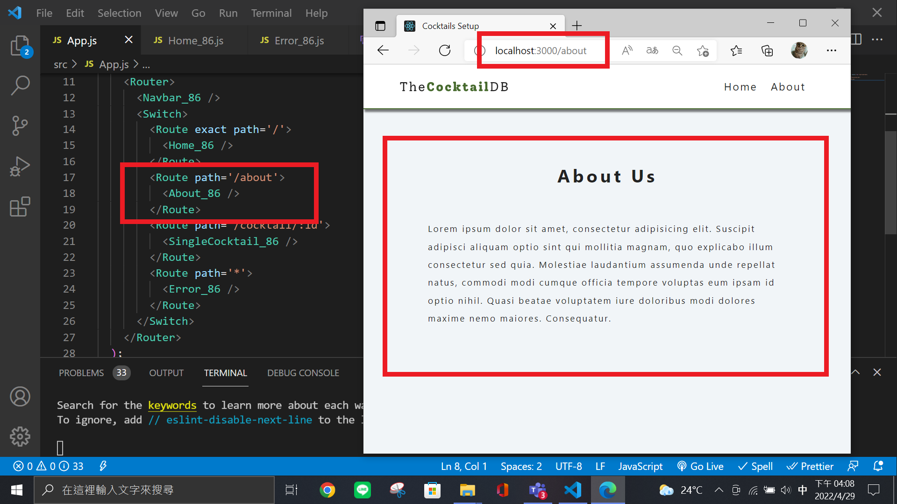
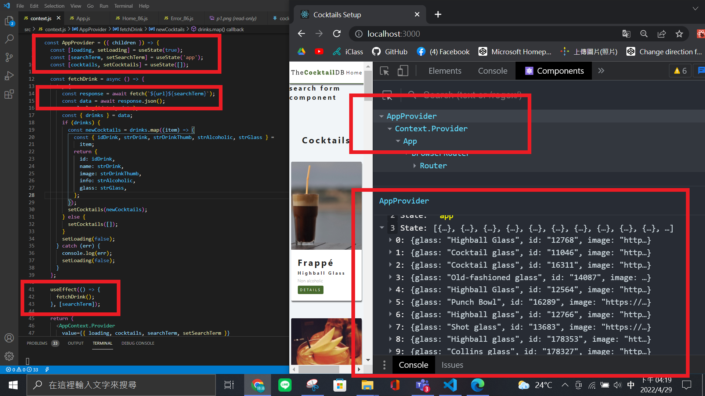
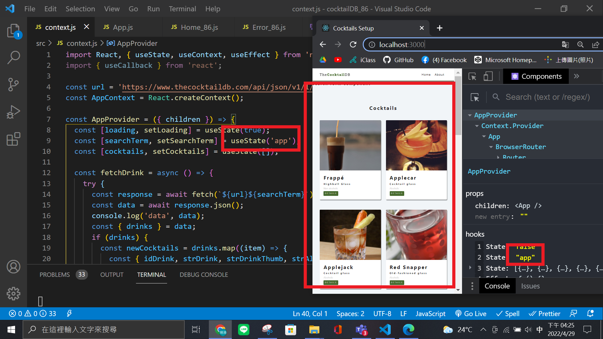
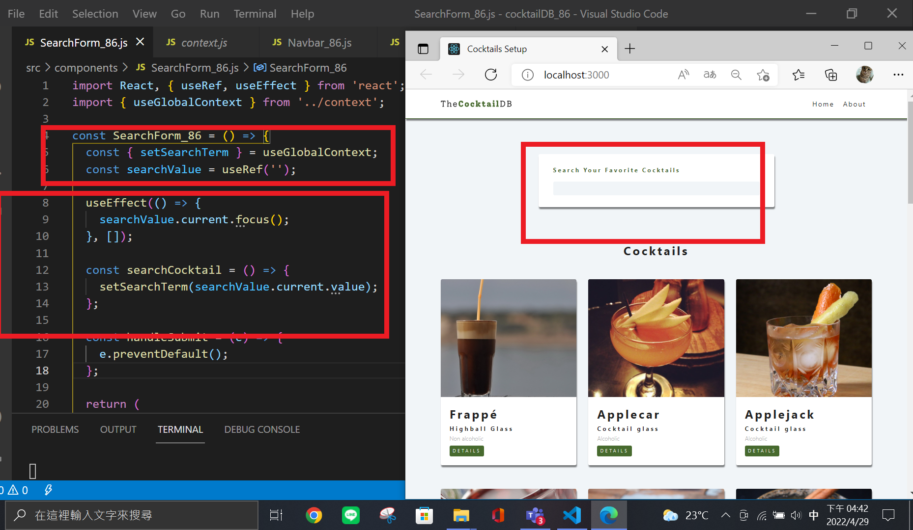

### P1: initial setup, change component name by adding 86

### w09-P2 <About_86 /> <Error_86 /> <Navbar_86 />

### w09-P3 finish context.js and fetch data shown in DevTools

### w09-P4 Show Cocktails with your own searchTerm

### w09-P5 Show Cocktails using searchTerm

